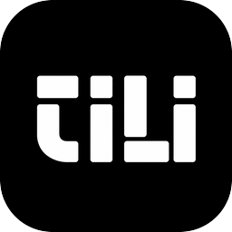

<div align="center">



# tili

**A tiling window manager for macOS, built for speed.**

i3-style workflow · public Accessibility API only · Rust · no SIP disable

[](https://github.com/itsdezen/tili/actions/workflows/ci.yml)
[](LICENSE)
[](https://www.rust-lang.org)
[](https://github.com/itsdezen/tili/releases)

[Website](https://tili.dezen.me) · [Getting started](#getting-started) · [Commands](#commands) · [Roadmap](ROADMAP.md) · [Contributing](#contributing) · [Architecture](#architecture)

[](https://buymeacoffee.com/itsdezen)

</div>

---

## Why tili

Most tiling window managers on macOS force a trade-off: either they poll the
screen and burn CPU doing it, or they reach for private, undocumented APIs
that break every time Apple ships a system update. tili takes neither
shortcut.

- **Event-driven, not polling.** The daemon subscribes to Accessibility and
  workspace notifications and reacts to them — it does no work while your
  windows aren't changing. That's the whole idea behind lower idle CPU/RAM
  than the alternatives.
- **Public API only.** Exactly one narrowly-scoped private call is used
  anywhere in the codebase (to resolve a window's real `CGWindowID`) —
  everything else is the public Accessibility API. You never disable System
  Integrity Protection to run tili.
- **A config format that matches how you think.** [KDL](https://kdl.dev)
  instead of flat TOML tables — workspaces, keybinding modes, and floating
  rules nest the way they actually relate to each other.
- **Animation-ready architecture, not animation-as-an-afterthought.** Every
  window-frame mutation goes through a single seam (`WindowFrameSetter`).
  v1 ships instant moves; smooth animated transitions plug into that same
  seam later without a rewrite.
- **No hotkey daemon required.** tili owns its own global hotkeys. One binary,
  one daemon, one config file.
- **Open source, installed via Homebrew.** No App Store, no sandbox
  restrictions on what a window manager needs to do.

## Status

tili is at `v0.1.x` and already daily-drivable: tiling, workspaces,
hot-reloaded config, built-in hotkeys, floating rules, multi-monitor,
mouse/focus-follows-monitor, a menu bar workspace badge, and a real signed
release pipeline. See [ROADMAP.md](ROADMAP.md) for what's planned next.
Pre-1.0 still means config schema and CLI surface can change between
releases — check [CHANGELOG.md](CHANGELOG.md) when upgrading.

## Getting started

```sh
brew install itsdezen/tap/tili
```

```sh
tili start
```

That's it — `tili start` installs a background LaunchAgent (auto-restart,
auto-start at login) and **waits** for tili-daemon to actually finish
starting before returning. Ctrl-C stops the wait without affecting the
daemon, which keeps running independently under launchd. First run:
- Triggers the **Accessibility permission** prompt, then the **Input
  Monitoring** one — grant both whenever you get to it; tili waits (up to
  a minute) and reports "running" the moment you do, no restart needed. If
  you don't grant Accessibility within that minute (or interrupt the wait
  yourself), the daemon stops itself cleanly and `tili start` reports
  that — just run it again once you're ready.
- Writes a starter config to `~/.config/tili/tili.kdl` if none exists yet
  — edit it and save, no restart needed, changes hot-reload. See
  [`example/tili.kdl`](example/tili.kdl) for the full commented version.

Use the keybindings from your config (or the `tili` CLI directly — see
[Commands](#commands) below) to focus/move/tile windows. Run `tili stop`
to stop it and remove the LaunchAgent (so it stays stopped until you run
`tili start` again), `tili status` to check whether it's running, and
`tili --version`/`tili help` for the installed version and full command
list.

> [!TIP]
> If a three-finger swipe up (Mission Control) shows tiled windows at
> tiny or wildly mismatched sizes, enable **Group windows by
> application** under **System Settings → Desktop & Dock → Mission
> Control** — this is a macOS Mission Control layout setting, not
> something tili controls.

## Menu bar badge

`tili start` also installs and starts `tili-menubar` alongside the daemon —
a small `NSStatusItem` badge showing the active workspace on your focused
monitor. Click it to switch workspaces, open your config file, or quit
(which stops the daemon too). It starts/stops/uninstalls automatically with
`tili start`/`stop`/`uninstall`, so there's nothing extra to run, and it
hides itself entirely whenever the daemon isn't reachable rather than
showing stale state.

## Other ways to install

`brew install itsdezen/tap/tili` above is the recommended path — it
installs a real, signed `tili.app` via
[itsdezen/homebrew-tap](https://github.com/itsdezen/homebrew-tap).

Building from source instead:

```sh
git clone https://github.com/itsdezen/tili
cd tili
cargo build --release --workspace
```

Or grab a prebuilt `tili.app` directly from a
[GitHub release](https://github.com/itsdezen/tili/releases) without
Homebrew. Releases are codesigned (see
[CONTRIBUTING.md](CONTRIBUTING.md#release-engineering)) but not notarized
yet, so Gatekeeper will still prompt on first launch — right-click → Open,
or `xattr -d com.apple.quarantine tili.app`.

## Preview: config

Configuration is [KDL](https://kdl.dev), read from `~/.config/tili/tili.kdl`
and hot-reloaded on save. This is a trimmed example — see
[`example/tili.kdl`](example/tili.kdl) for the full, commented,
copy-pasteable version:

```kdl
workspaces {
    workspace "work"
    workspace "entertain"
    workspace "random"
}

gaps {
    inner 4
    outer 8 8 8 8
}

settings {
    auto-reload #true
    mouse-follows-focus #false
    focus-follows-monitor #false
}

keybindings mode="main" {
    bind "alt-h" "focus left"
    bind "alt-shift-h" "move left"
    bind "alt-w" "workspace work"
    bind "alt-slash" "layout toggle"
    bind "alt-m" "focus-monitor"
}

floating-rules {
    rule app-id="com.apple.finder"
    rule app-id="com.apple.systempreferences" { width 900; height 600; center #true }

    defaults { center #true; width-ratio 0.6; height-ratio 0.6 }
}
```

## Commands

`tili start`/`stop`/`uninstall`/`status` manage the daemon's LaunchAgent itself;
everything else below is a client command sent over a Unix socket to a
daemon that's already running — the same commands are also what
keybindings in your config resolve to (e.g. `bind "alt-h" "focus left"`).

| Command | What it does |
|---|---|
| `tili` (no subcommand) | Same as `tili start`, after an Enter-key confirmation |
| `tili start` | Install and start tili-daemon as a background LaunchAgent (auto-restart, auto-start at login) |
| `tili stop` | Stop tili-daemon and remove its LaunchAgent |
| `tili uninstall` | Full teardown: stop the daemon, remove its config/logs/socket, and reset the Accessibility grant |
| `tili status` | Report whether the daemon is running |
| `tili ping` | Check the daemon is reachable (scripting-friendly; see `status`) |
| `tili --version`/`-V` | Print the installed version |
| `tili help` | Print the full command list (same as `--help`/`-h`) |
| `tili focus <left\|right\|up\|down>` | Move focus to the window in that direction |
| `tili move <left\|right\|up\|down>` | Move the focused window one step in that direction, re-parenting it through the tree |
| `tili join <left\|right\|up\|down>` | Wrap the focused window and its neighbor into a new, perpendicular container |
| `tili resize <amount>` | Grow (positive) or shrink (negative) the focused window's share of its nearest tiled container |
| `tili balance [--root]` | Reset child weights of the focused container (or workspace root) evenly |
| `tili layout <toggle\|tiles\|accordion\|horizontal\|vertical\|toggle-orientation> [--root]` | Toggle or set the focused container's layout/orientation |
| `tili flatten` | Re-normalize the tree (no-op today — normalization already runs after every mutation) |
| `tili fullscreen [--native]` | Toggle the focused window fullscreen (tiled, or `--native` for a separate Space) |
| `tili close` | Close the focused window (best-effort) |
| `tili summon <query>` | Focus (and raise) the first known window whose title or bundle id matches `query` |
| `tili set-floating <on\|off>` | Toggle the focused window between tiled and floating at runtime |
| `tili workspace <name>` | Switch the active workspace (created if new) |
| `tili workspace-back` | Switch back to whichever workspace was active before this one |
| `tili move-to-workspace <name>` | Move the focused window to another workspace |
| `tili move-workspace-to-monitor <target> [--workspace <name>]` | Move a workspace to a different monitor without switching focus; defaults to the workspace currently active on the focused monitor |
| `tili list-workspaces` | List workspaces, with active/monitor markers |
| `tili focus-monitor` | Cycle which connected monitor commands target |
| `tili list-monitors` | List connected monitors |
| `tili list-windows` | List known windows (tiled/floating, frame, pid) |

## Architecture

tili is a Cargo workspace split along strict boundaries so the hardest parts
(the container tree, the layout algorithms) can be tested without a Mac at
all, and the parts that touch the OS (`AXUIElement`, `NSWorkspace`, display
reconfiguration) stay isolated in one place.

```
crates/
├── tili-tree     pure container-tree + layout algorithms (Tiles/BSP, Accordion)
├── tili-ax        Accessibility API integration, the WindowFrameSetter seam
├── tili-config    KDL parsing + validation, hot-reload
├── tili-ipc        shared daemon/CLI protocol types
├── tili-daemon     the window manager: event loop, state, hotkeys
├── tili-cli        the `tili` command-line client
└── tili-menubar    the menu bar workspace badge
```

The daemon is single-threaded around one piece of state: every command,
whether it comes from a global hotkey or the CLI over a Unix socket, flows
through the same `dispatch(&mut WmState, Command) -> Response` function. No
locks, no drift between "what the hotkey does" and "what the CLI does."

Workspaces are virtual — macOS exposes no public API to control Spaces, so
inactive-workspace windows are parked off-screen rather than relying on real
Spaces, the same technique other public-API-only tools in this space use.

## Contributing

tili is early enough that architectural feedback is as valuable as code.
Check [ROADMAP.md](ROADMAP.md) for what's planned — each item there is
scoped to be independently pickup-able. See [CONTRIBUTING.md](CONTRIBUTING.md)
for dev setup, the pre-PR test gate, and the design invariants PRs are
expected to respect. Bug reports and feature requests use the issue
templates; general questions go in
[Discussions](https://github.com/itsdezen/tili/discussions).

Releases ship continuously as features land — see
[`.github/workflows/release.yml`](.github/workflows/release.yml) and
[CHANGELOG.md](CHANGELOG.md) for the process and versioning convention.

## Security

Found a vulnerability? See [SECURITY.md](SECURITY.md) — please don't open a
public issue for security reports.

## Code of Conduct

This project follows the [Contributor Covenant](CODE_OF_CONDUCT.md).

## Acknowledgments

tili exists because [AeroSpace](https://github.com/nikitabobko/AeroSpace) is
great and I wanted an excuse to rewrite it in Rust anyway. Not because Rust
is faster (it isn't, meaningfully) — just because Cargo, the type system,
and shipping one static binary make for a nicer afternoon than I was
having otherwise. Thank you, AeroSpace, for existing. 🙏

tili is fully open for contributions — issues, PRs, "this config option
should really work differently," all of it welcome.

## License

[MIT](LICENSE)
